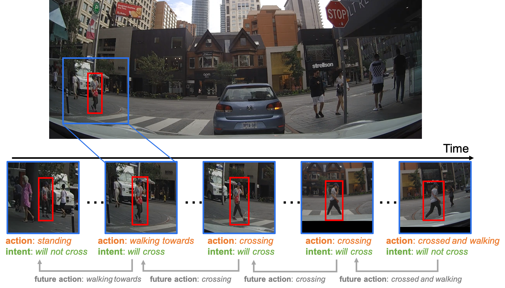

# Pedestrian Intent Action Detection
This repo contains code of our paper "Coupling Intent and Action for Pedestrian Crossing Behavior Prediction." 

_Yu Yao, Ella Atkins, Matthew Johnson-Roberson, Ram Vasudevan and Xiaoxiao Du_



# installation
Assume the code will be downloaded to a `WORK_PATH` and the datasets are saved in `DATA_PATH`
1. Clone this repo.
```
cd WORK_PATH
git clone https://github.com/umautobots/pedestrian_intent_action_detection.git
cd pedestrian_intent_action_detection
```
<!-- 2. Add some symlinks to large-storage dick where data, checkpoints and outputs are saved.
```
ln -s /mnt/workspace/datasets/ data
ln -s /mnt/workspace/users/PATH_TO_SAVE_OUTPUT output (optional)
ln -s /mnt/workspace/users/PATH_TO_SAVE_CHECKPOINTS checkpoints (optional)
``` --> 

2. Docker
Build the docker image:
```
cd pedestrian_intent_action_detection
docker build --tag intention2021ijcai docker/
```

Create docker container by running the following command, use `shm-size` to increase shared memory size. Use `-v` or `--volumn` to mount code and data directory to the container:
```
docker create -t -i --gpus all --shm-size 8G -v WORK_PATH/pedestrian_intent_action_detection:/workspace/pedestrian_intent_action_detection -v DATA_PATH:/workspace/pedestrian_intent_action_detection/data intention2021ijcai:latest
```
where the `WORK_PATH` is where the repo is cloned to and the `DATA_PATH` is where the `PIE_dataset` and `JAAD` locates, for example is your PIE data is saved in is `/mnt/data/PIE_dataset`, then `DATA_PATH=/mnt/data`.

This generates a CONTAINER_ID, then start container in interactive mode by 

```
docker start -a -i CONTAINER_ID
```
3. Run setup in the container.
Run setup script
```
python setup.py build develop
```

# Data
We have tested our method with [PIE](https://data.nvision2.eecs.yorku.ca/PIE_dataset/) and [JAAD](https://data.nvision2.eecs.yorku.ca/JAAD_dataset/) datasets. Users should follow their original instruction to download and prepare datasets. Users also need to get the extracted features from a pretrained VGG16 following the [PIEPredict repo](https://github.com/aras62/PIEPredict). As another option, users can download the vg166 features we extracted using PIEPredict code [here](https://drive.google.com/file/d/1xQAyvqE2Q4cxvjyWsCEJR09QjB7UYJIV/view?usp=sharing) and put it in `DATA_PATH/PIE_dataset/saved_output`.

# Train
Run following command to train model with original PIE data annotation:
```
python tools/train.py \
    --config_file configs/PIE_intent_action_relation.yaml \
    --gpu 0 \
    STYLE PIE \
    MODEL.TASK action_intent_single \
    MODEL.WITH_TRAFFIC True \
    SOLVER.INTENT_WEIGHT_MAX 1 \
    SOLVER.CENTER_STEP 800.0 \
    SOLVER.STEPS_LO_TO_HI 200.0 \
    SOLVER.MAX_ITERS 15000 \
    TEST.BATCH_SIZE 128 \
    SOLVER.SCHEDULER none \
    DATASET.BALANCE False
```

Run following command to train model with SF-GRU style data annotation, change `--config_file` to `configs/JAAD_intent_action_relation.yaml` or `configs/PIE_intent_action_relation.yaml` to train on JAAD or PIE datasets. :
```
python tools/train.py \
    --config_file PATH_TO_CONFIG_FILES \
    --gpu 0 \
    STYLE SF-GRU \
    MODEL.TASK action_intent_single \
    MODEL.WITH_TRAFFIC True \
    SOLVER.INTENT_WEIGHT_MAX 1 \
    SOLVER.CENTER_STEP 800.0 \
    SOLVER.STEPS_LO_TO_HI 200.0 \
    SOLVER.MAX_ITERS 15000 \
    TEST.BATCH_SIZE 128 \
    SOLVER.SCHEDULER none \
    DATASET.BALANCE False
```

# Test with trained models.
Change 1) `STYLE` value to `PIE` or `SF-GRU` ; 2)`--config_file` to corresponding datasets, and 3) `CKPT` to corresponding checkpoints to run the test. For example: 
 
``` 
python tools/test.py \
    --config_file configs/PIE_intent_action_relation.yaml \
    --gpu 0 \
    STYLE PIE \
    CKPT_DIR saved_models/all_relation_original_PIE.pth
    MODEL.TASK action_intent_single \
    MODEL.WITH_TRAFFIC True \
    TEST.BATCH_SIZE 128 \
    DATASET.BALANCE False
```